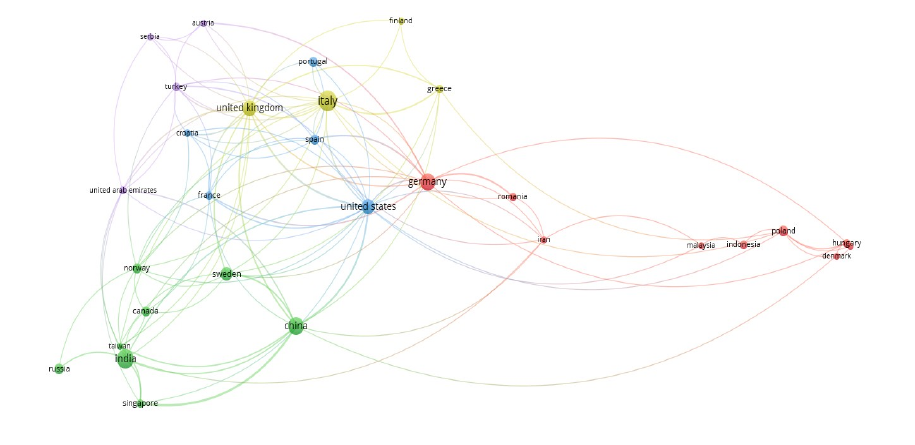
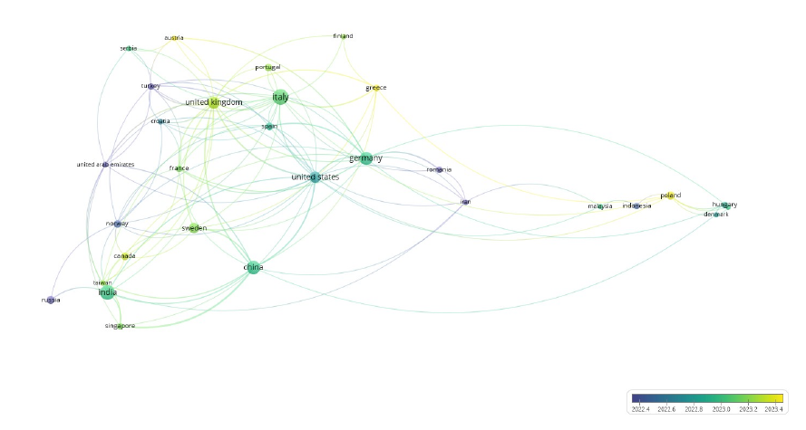

# Introduccion

La industria enfrenta hoy la llamada Revolución Industrial 4.0, marcada por la automatización total de la manufactura y la creación de redes inteligentes de autocontrol en toda la cadena de valor (Yáñez, 2017), lo cual exigirá a la industria transformaciones profundas basadas en principios fundamentales como la interoperatibilidad, descentralización, capacidad en tiempo real, virtualización y modularización, las que permitirán la autorregulación y la integración digital dentro y fuera de los límites de la organización (Galar et al., 2020, Prause, 2019).
Esta transformación de la gestión de negocios, será conducida a través de redes productivas globales (maquinaria, sistemas de almacenamiento e instalaciones de producción) en forma de Sistemas Ciber Físicos (CPS) que intercambiarán información autónomamente, ejecutando procesos y acciones de control independientes en tres dimensiones: la cadena de valor, el ciclo de vida del producto y la integración de los sistemas de fabricación en red (Galar et al., 2020), optimizando sus procesos, mejorando la rentabilidad y en consecuencia, la continuidad y sustentabilidad del negocio, en un proceso transformativo que requerirá de habilitadores digitales, es decir, tecnologías digitales 4.0 o “Key Enabling Technologies” (KETs) (Yáñez, 2017).
Sin embargo, la irrupción desarticulada de esta nueva revolución, al igual que en anteriores revoluciones industriales, generará una brecha tecnológica entre países, dada la disparidad en el desarrollo y apropiación de tecnología, debido a limitaciones financieras, organizacionales y el contexto en el cual las organizaciones se desenvuelven, situación homologable a las empresas en función de su tamaño, derivado del surgimiento de fuerzas que limitan y dificultan la adopción de tecnologías al interior de las Pequeñas y Medianas Empresas (PyMEs), evidenciando una realidad dispar de la gestión innovadora entre éstas y las grandes compañías (Reyes, 2018) y cuyas causas pueden ser diversas y estar relacionadas con factores como la escasez de recursos financieros, el acceso no igualitario a financiamiento, la falta de tecnología, por desconocimiento o limitación de recursos, la capacitación del personal e inmadurez del soporte TI, resistencia al cambio, una falta de claridad en los beneficios de la implementación, el riesgo en la seguridad de los datos y en los puestos de trabajo, la falta de cultura digital interna, el reducido tamaño de la empresa, la falta de visión digital y liderazgo de la alta dirección para asumir el proceso de transformación 4.0, la ausencia o insuficiencia de políticas públicas, que desde un estado activo, ayuden a fortalecer las condiciones para su desarrollo, entre otras (Arnold et al., 2018; Gatica y Ramos, 2022; Maggi et al. 2020; Mazzucato y McPherson, 2019; Prause, 2019; Reyes, 2018; Wischmann et al. 2015, citado por Prause, 2019).
En tal sentido, para disminuir o al menos poner freno a estas brechas emergentes, se requiere de un actuar con convicción, determinación y liderazgo en el desarrollo de una estrategia para la implementación exitosa de la Industria 4.0 (I4.0) y como consecuencia de ello, alcanzar los beneficios y el mejoramiento esperado de la introducción de sus tecnologías habilitantes, en un proceso que debe moverse dentro de un marco referencial que permita visualizar las tecnologías de soporte físicas y digitales capaces de apoyar los procesos de la cadena de suministro global desde el abastecimiento hasta el mercado, pasando por la producción y la distribución de los productos y/o servicios de la empresa, considerando las características propias de la cadena de suministro en la que se inserta una industria en particular y los resultados estratégicos esperados en el ámbito de la I4.0 (He y Turner, 2021).
En este camino, resulta clave conocer el nivel de desarrollo tecnológico en que se encuentra la industria, cualquiera sea su naturaleza y el sector económico al cual pertenezca y para ello, los modelos de madurez (MMs) constituyen una herramienta útil para la determinación y calificación de las capacidades de los elementos que maduran y como consecuencia de su aplicación, permitir la determinación de acciones apropiadas para alcanzar un nivel más alto de madurez (Kohlegger et al., 2009), en un proceso de mejoramiento continuo, que en el contexto de la I4.0, contribuirá a determinar el estado de preparación o el nivel de madurez en el uso de las tecnologías habilitantes asociadas y proporcionar medidas para mejorar su status tecnológico (Kieroth et al., 2022), coaccionando patrones predecibles de evolución y cambio organizacional, que representan teorías de evolución y transformación de las capacidades de una organización a lo largo de un camino definido, deseado o lógico, desde un estado inicial a maduro; y en el que su nivel de madurez, se debe entender como la evidencia objetiva de la capacidad respecto a una clase concreta de objetos y dominio de aplicación.
(Pöppelbuss y Röglinger, 2011, Röglinger et al., 2012).
De acuerdo a lo descrito por Pöppelbus y Röglinger, 2011, se distinguen tres propósitos específicos de aplicación para el uso de los MMs:

-   Descriptivo: Modelos diseñados para la determinación del estado de situación actual.
-   Prescriptivo: Modelos normativos que proveen recomendaciones claras para la acción y guías para el desarrollo.
-   Comparativo: Modelos que permiten a las empresas y organizaciones ser localizadas y comparadas tanto interna como externamente.

Jacquez-Hernández y López (2018) señalan la existencia de muchos MMs hacia la I4.0, pero que todos divergen en su metodología y criterios de evaluación, concluyendo que no existe un modelo único y probado que represente a todas las industrias y países, más aún si se considera la novedad de la I4.0.
Desde el punto de vista de la Industria 4.0, los MMs pueden estar enfocados en objetos y dominios diversos que expliquen el estado en que se encuentra la industria respecto de elementos y/o factores establecidos en el objetivo central de dicha determinación.
Como, por ejemplo, MMs para determinar el nivel de preparación de la industria hacia la implementación de la I4.0 o para mejorar dicho proceso, para determinar la madurez respecto de la habilitación del Internet de las Cosas (IoT) o el nivel de madurez de la I4.0 desde la óptica de la cadena de suministro global, entre otras (de Carolis et al., 2017¸ Jæger y Halse, 2017; Gracel & Lebkowsky, 2017; Yañez, 2017; Spaltini et al., 2022; Santos y Martinho, 2019; Rauch et al., 2020; García-Reyes et al., 2022; Simetinger y Basl, 2022; Dahl, 2021) y por lo tanto, la representación de la madurez bajo los paradigmas de la I4.0 estará condicionada por la dimensión que se defina como el objetivo central del MM aplicado.
A más de una década de la introducción de la Industria 4.0, enfocada principalmente en el logro de los objetivos económicos a través de la transformación digital y la automatización de procesos de trabajo rutinarios (Hein-Pensel et al., 2023), la Comisión Europea anunció el advenimiento de lo que llama la Industria 5.0, que a diferencia de la anterior, impulsada por la habilitación de tecnologías, se basa en la creación de valor (Xu et al, 2021) y el logro de objetivos sociales y ecológicos basados en un enfoque holístico, sustentable y centrado en el humano (Hein-Pensel et al., 2023), traspasando las vallas de la eficiencia y la productividad, hacia una valorización superior de respeto a los valores humanos y la contribución a las necesidades vitales de la sociedad, poniendo el bienestar de los trabajadores junto con otros valores humanos (relacionados con los empleados, los clientes y la sociedad en general) en el centro de los procesos de fabricación/producción, además de la ecología del planeta como factor limitante y condicionante de la gestión productiva, como parte de un proceso de transición hacia una industria centrada en el ser humano, sostenible y resiliente (Golovianko et al, 2023).
Según la Comisión Europea (2021), “La Industria 5.0 reconoce el poder de la industria para alcanzar objetivos sociales más allá del empleo y el crecimiento, para convertirse en un proveedor resistente de prosperidad, haciendo que la producción respete los límites de nuestro planeta y situando el bienestar del trabajador de la industria en el centro del proceso de producción”.
Sin embargo, la coexistencia de dos revoluciones industriales plantea desafíos y preguntas que exigen discusiones y aclaraciones relevantes como, por ejemplo, ¿Hasta qué punto la Industria 4.0 está centrada en la tecnología y olvida la centralidad humana, la sustentabilidad y la resiliencia?;
¿Pueden las tecnologías habilitadoras de la Industria 4.0 ayudar también a alcanzar los objetivos de la Industria 5.0, o necesitamos desarrollar nuevas tecnologías de la Industria 5.0?;
¿Es la Industria 5.0 una continuación cronológica de la Industria 4.0, similar a sus predecesoras (desde la Industria 1.0 hasta la Industria 4.0)?;
¿Vivimos entre dos revoluciones industriales o, en realidad, una: la revolución tecnosocial?;
¿Cómo sería el proceso de transformación de la industria hacia la Industria 4.0 y la Industria 5.0?
(Xu et al, 2021).
Sin perjuicio de la importancia de estas preguntas y sus respectivas respuestas, lo que parece relevante en esta dinámica vinculante de ambas industrias, es la necesidad de visualizar de qué manera la industria y en especial las empresas del segmento PyMEs se preparan, sobre la base de su realidad inherente, para la incorporación de tecnologías habilitadoras consistentes con la Industria 4.0, pero que tomen en consideración los nuevos paradigmas que introduce la naciente Industria 5.0, la que de alguna manera se hace cargo de la mayor conciencia por la protección del medio ambiente, que en el mundo de hoy se ha visto entre las organizaciones contemporáneas, las cuales intentan establecerse como industrias sustentables, en un tránsito “verde”, cuya definición incorpora diferentes aspectos ambientales (Hasan et al., 2024).
Es en este contexto de cambios paradigmáticos de la Industria 4.0, que la complejidad de la digitalización se ve incrementada debido a la incorporación de las nuevas dimensiones que introduce la Industria 5.0, más aún si se considera el estrechamiento colaborativo directo entre humanos y máquinas y en especial en el segmento empresarial de las PyMEs, las que se ven enfrentadas a desafíos mayores producto de la limitación de recursos para implementar una estrategia de digitalización exitosa (Hein-Peinsel et al., 2023).
Este escenario confiere a los modelos de madurez (MMs) una valiosa relevancia como herramienta para dar forma a la transición de la digitalización de las empresas estratégicamente alineada, los cuales desde una perspectiva integrada y holística, deberían llevar a la concepción de MMs de la Industria 4.0 que contemplen los elementos claves de las dimensiones específicas de la Industria 5.0 como la centralidad en el humano, la resiliencia y la sustentabilidad y permitir una evaluación integral del estado de preparación de las compañías hacia la implementación de tecnologías y procesos disruptivos vinculados con la I4.0 (Hein-Pensel et al., 2023).
De acuerdo a la situación que se plantea, y en una primera fase de investigación, se considera de interés conocer la existencia de MMs de la I5.0 a nivel de la literatura y ver de qué forma esos modelos se vinculan o se podrían vincular con los objetivos particulares de la I4.0, generando una base de criterios y conceptos integrados que permitan trabajar en la definición de un MM integrado capaz de determinar el estado de madurez de las empresas desde la óptica de la I4.0, pero teniendo en cuenta los elementos propios de la naciente Industria 5.0.

# Justificación

La importancia de un enfoque centrado en el ser humano para todos los aspectos de la digitalización cambia la forma de considerar los requisitos de preparación para alcanzar ciertos niveles de madurez digital y capacidad de implementación de las tecnologías habilitantes que la sustentan.
Esto significa que los MM deben ser una conjunción de los MM de la Industria 4.0 y los tres pilares de la Industria 5.0, al determinar la madurez digital (diseño centrado en el ser humano, resiliencia y sustentabilidad), más aún si consideramos la estrecha relación entre ambas industrias y la carencia de MM específicamente desarrollados para la Industria 5.0 (Hein – Pensel et al., 2022).
La implementación de la Industria 5.0 requiere un enfoque basado en la integración de tecnologías avanzadas, como la inteligencia artificial, la robótica, la computación de borde, entre otras, en un entorno de fabricación centrado en el ser humano y la sustentabilidad, lo cual implica el desarrollo de habilidades y conocimientos necesarios dentro de las organizaciones para colaborar con estas tecnologías, así como crear procesos de fabricación flexibles que puedan adaptarse a las cambiantes demandas del mercado y a los impactos medioambientales (Bajic, et al., 2023).
La Industria 5.0 adquiere relevancia no sólo debido a su objetivo de optimización de la producción y la eficiencia, sino que también por poner el acento en el bienestar humano, la sustentabilidad y la resiliencia, lo que permite preparar a las empresas para enfrentar los desafíos del futuro (Arta et al., 2024), evidenciándose en ella una singularidad tecnológica, que algunos como Mantilla (2019), citado por Travez y Villafuerte (2023), la consideran como una evolución dada por la personalización, la armonía de la computación cognitiva e industrial (robots colaborativos), vinculando los conceptos de Sociedad 5.0 e Industria 5.0 en el sentido de que ambos se refieren a un cambio fundamental de nuestra sociedad y economía hacia un nuevo paradigma, en una clara transformación de las industrias desde las basadas en la producción a las basadas en el valor, centrándose en los beneficios sociales y ambientales, así como en la obtención de beneficios económicos, pero dando mayor énfasis al valor ambiental y social, lo cual permitirá a las empresas asumir los desafíos de la industria moderna y garantizar la sustentabilidad y continuidad del negocio (European Commission, 2021).
Es en este contexto de trasformación de la industria, de constante cambio y evolución de los factores internos y externos del entorno, exacerbado por la globalización, que los paradigmas de la I4.0 y la I5.0 se conectan y vinculan, haciéndose cargo de esta realidad con el propósito de, a nivel de las organizaciones, lograr un fortalecimiento de su gestión innovadora, incorporando tecnología con el objetivo de maximizar la rentabilidad del negocio, pero con especial énfasis en una gestión centrada en las personas, en la sustentabilidad y que en base al monitoreo permanente de los factores del entorno cambiante y una actitud resiliente, transformando riesgos en oportunidades, les permita dar continuidad al negocio y conducirlas a posiciones de mayor relevancia en el mercado.
Claro es el panorama que enfrenta la industria, y este desafío transformador implica llevar adelante procesos de adopción tecnológica realistas, es decir, basados en las fortalezas y debilidades de la empresa, particularmente en las PyMEs, con especial preocupación en la internalización de los pilares de la I5.0.
El punto de partida entonces será conocer el nivel de madurez en que la empresa se encuentra respecto a su preparación para enfrentar este reto y desde allí, formular una estrategia de desarrollo realista capaz de conducirla a estados de madurez superiores.
Por tal razón, resulta de interés revisar a nivel de la literatura la existencia de modelos de madurez tecnológica 5.0 y desde esa base, sentar las bases de investigaciones futuras tendientes a medir el nivel de preparación de las empresas respecto a los paradigmas de la I5.0 que les permitan modelar estrategias de desarrollo potencial empresarial hacia niveles de posicionamiento superior, con especial foco en las acciones que en tal sentido deben emprender las empresas del segmento PyMEs, las cuales se ven fuertemente expuestas a factores inhabilitantes y restrictivos que frenan o impiden los procesos de adopción tecnológica.

# Objetivos

## Objetivo general

El objetivo general de la investigación es conocer a nivel de la literatura la existencia de MMs basados en la Industria 5.0 y analizar de qué manera estos se vinculan con los objetivos propios de la Industria 4.0 hacia la definición de un modelo de madurez integrado.

## Objetivos específicos

-   Analizar modelos existentes de la I5.0 desde la base de sus dimensiones y factores claves de su estructura y los niveles o estadios de madurez de evaluación.

-   Analizar y determinar los vínculos tecnológicos y relacionales de los MM de la I5.0 y sus pilares de sustentación, con aquellos propios de la Industria 4.0, como base para el desarrollo de investigaciones futuras que tengan como objetivo la proposición de un MM integrado I4.0 - I5.0.

# Materiales y Métodos

El trabajo que se presenta consiste en una revisión sistemática de la literatura (RSL) haciendo uso de las plataformas abiertas “Dimensions AI” y “Google Scholar” y de la aplicación VOS Viewer y Excel para el análisis y presentación de los resultados.
El desarrollo de la metodología de revisión bibliográfica fue conducido en base a un enfoque estructurado por vom Brocke et al., 2009 y citado por Hein-Pensel et al., 2022, el cual consta de tres fases y cinco etapas, según se muestra en la Fig.
1.

## Generalidades

El trabajo que se presenta consiste en una revisión sistemática de la literatura (RSL) haciendo uso de las plataformas abiertas “Dimensions AI” y “Google Scholar” y de la aplicación VOS Viewer y Excel para el análisis y presentación de los resultados.

A modo de abundamiento y desde el punto de vista práctico, la conducción metodológica se basó en la secuencia de actividades que se presentan a continuación (Fig. 2):

La RSL tuvo como punto de partida la búsqueda de investigaciones relacionadas con la Industria 5.0, pero especialmente de aquellas vinculadas con la presentación de modelos de madurez para medir el nivel de preparación de las organizaciones para su implementación o de criterios relevantes para su formulación.

Como complemento a esta base, se realizó una revisión de los artículos del registro bibliográfico del autor.

Posterior a la obtención de la base general de artículos, se efectuó un análisis de pertinencia/relevancia de los documentos encontrados, para llegar finalmente a definir la base de revisión y análisis.

Como etapa final y como consecuencia de la obtención de la base de documentación de análisis, se procedió a realizar una revisión acuciosa de los modelos propuestos y/o de los elementos clave considerados en su formulación, de tal forma de detectar los elementos relevantes y su vinculación con los “drivers” centrales de la Industria 4.0.

Considerando que el objetivo del estudio es conocer a nivel de la literatura pertinente, la existencia de MMs basados en la Industria 5.0 y de qué manera estos se vinculan con los objetivos de la Industria 4.0, hacia la definición de un modelo de madurez integrado, se ha desarrollado una revisión y análisis basada en el enfoque metodológico presentado en la Fig.
2.

### Etapa I: Definición de los criterios de investigación formal.

En base a búsquedas preliminares de MMs para la I5.0 a nivel de la literatura, fue posible detectar una importante bibliografía relacionada a esta industria, sin embargo, una escasa representación de MMs vinculados a ella, por lo que no se adoptaron restricciones relevantes al proceso de búsqueda.

La Tabla 1 muestra el cuadro regulatorio base de la búsqueda de literatura aplicada:

#### CRITERIOS DE SELECCIÓNDE LA RSL

| CRITERIO | VALOR |
|--------------------------|----------------------------------------------|
| Período de publicación | Sin restricciones |
| Acceso | Libre (Free documents) |
| Lenguaje | Inglés y español |
| Calidad científica | Sin restricciones |
| Tipo | No citas, no libros, sólo artículos |
| Contenido | Sólo contenido relevante a los bjetivos.Dimensiones y niveles de madurez indicados. |
| Formalidades | Publicaciones formales |

A pesar de la evidencia preliminar de una masa relevante de artículos que abordan o mencionan de alguna manera la temática de la I5.0, pero una escasa literatura vinculada a los MMs de dicha industria se decidió desarrollar de igual forma la investigación para conocer el alcance de los modelos existentes y las dimensiones y factores relevantes de su concepción.
En tal sentido y después de analizar los criterios de expansión y los string claves para la búsqueda final, ésta fue estructurada sobre la base del siguiente “query”: "Industry 5.0" OR "I5.0" OR "Industria 5.0" AND "Maturity" OR "Level" Este criterio de búsqueda aplicado en la plataforma Dimensions AI, fue utilizado tanto a nivel de “Full text” como de “Title and abstract” y cuyos resultados se muestran en la Tabla 2 siguiente:

En la misma tabla se presentan los parámetros base aplicados en VOS Viewer, resultados que serán presentados más adelante.
Como complemento a las búsquedas en Dimensions AI, se realizó una búsqueda complementaria en la plataforma abierta Google Scholar, pero dirigida especialmente a la captura de publicaciones relacionadas directamente con modelos de madurez de la I5.0.
Para tal efecto, la función “query” utilizada y sin restricciones, fue la siguiente: "industry 5.0 maturity model".

## Fase 2: Búsqueda sistemática de la literatura.

Etapa III: Revisión de la literatura.
Tal como se ha señalado, la revisión de la literatura se realizó fundamentalmente haciendo uso de la plataforma abierta Dimensions AI con apoyo de Google Scholar, especialmente para la captura de artículos de interés.
Sin perjuicio de lo anterior, es importante señalar que dada la reciente irrupción del concepto de Industria 5.0.
los artículos, desde el punto de vista del año de publicación, son en general de mucha actualidad.
El Gráfico 1, el cual está basado en los datos de la “Búsqueda 1” (Tabla 2), es decir la totalidad de las publicaciones encontradas en Dimensions AI, para un filtro “Full text”, muestra la temporalidad de los artículos que de alguna manera vinculan el concepto de la I5.0 y que claramente se centran en los 2020s.

En términos generales la revisión permitió la selección de artículos, previo a un análisis de datos mediante la herramienta bibliométrica VOS Viewer, tomando en consideración las parametrizaciones que se muestran en la Tabla 2, particularmente el conjunto de publicaciones capturadas en la “Búsqueda 2” y cuyos resultados se presentan a continuación:

### Representación 1: Países de publicación

Visualización de redes

Visualización de superposición:

Visualización de densidad:

Desde el punto de vista de los países relacionados con la literatura rescatada Fig.
3, 4 y 5), se observa claramente una tendencia hacia tres “clusters” relevantes como son el de Alemania – Estados Unidos, el de Italia – Portugal – España – Reino Unido, el de India – Canadá y el de China por si solo, todos los cuales tienen altos grados de vinculación en redes y claramente una tendencia de temporalidad de las publicaciones hacia los años más recientes.

### Representación 2: Autores y Co-Autores

Visualización de redes:

Desde el punto de vista de los autores, estos se vinculan principalmente a los países señalados anteriormente, sin embargo, dado que el análisis se efectuó sobre la masa general de publicaciones que hacen mención a la I5.0, no hubo una estrecha coincidencia con los autores de las publicaciones sobre MMs que fueron analizadas, más aún si consideramos la escasez de artículos que presentan modelos de madurez para la I5.0 o que de alguna manera se relacionan con ellos.
Sin embargo, el catastro final de publicaciones de análisis, si bien restringido, servirá para reconocer su vinculación con los distintos temas de interés relacionados y que pueden servir de base a investigaciones futuras de la I5.0.

### Etapa IV: Filtrado y categorización.

Siguiendo las bases de las restricciones indicadas por Große-Schwiep et al., 2020, y señaladas en la Tabla 1, fue posible construir la base de artículos de análisis, la cual se muestra en la Fig.
9:

Los resultados de la Fig.
9, que tomaron como base los resultados expuestos en la Tabla 1, fueron construidos considerando una base general de 13.844 documentos seleccionados mediante Dimensions AI y sin filtros mayores a los establecidos y dentro de cuyo texto (full text) se encontraron las “Key words” incorporadas en la “query” respectivas, selección que se redujo a 396 cuando la búsqueda se circunscribió a los títulos y abstract de las publicaciones, de las cuales sólo 7 fueron pertinentes y relevantes para el análisis.
Paralelamente, pero sobre la base de una “query” más restrictiva, se realizó una búsqueda en Google Scholar, la cual arrojó un resultado de sólo 8 publicaciones vinculadas, las que producto de una revisión general permitió seleccionar sólo 2 artículos pertinentes y relevantes.

Considerando la duplicidad de artículos, la base general de análisis se redujo a un total de 7 publicaciones, la cual se amplió a 8, con la incorporación de un artículo adicional del autor.

## Fase 3: Análisis y evaluación

### Etapa V: Análisis y evaluación

En esta etapa se presentan los resultados obtenidos de la RSL, los que como ya se ha mencionado, corresponden a la revisión y análisis de 8 publicaciones relevantes vinculadas a MMs de la I5.0.
Los resultados obtenidos se presentan en la Tabla 3, la que muestra una caracterización estructural de los MMs analizados, principalmente respecto de las dimensiones, factores, criterios y niveles de evaluación.
La Tabla 4 por otra parte, presenta información de cada uno de los MMs de análisis, la cual está estructurada para entregar las características descriptivas relevantes de dichos MMs y particularmente sobre la industria de aplicación, el propósito y alcance del modelo, la o las tecnologías habilitadoras en las cuales se centra, la cobertura de uno o más de los pilares de la I5.0 (Centralidad en el humano, resiliencia y sustentabilidad), el método utilizado en la captura de la información, y respecto del modelo en sí, la cantidad de dimensiones y/o factores de construcción, los criterios para la evaluación del estado de madurez y los niveles propuestos para la clasificación de dicho estado, elemento fundamental para determinar el punto de partida de la industria respecto a la industrialización 5.0, pero especialmente para sentar las bases de una estrategia de desarrollo potencial hacia el posicionamiento de estadios superiores.

### Modelos de Madurez en Industria 5.0

| **Autores, Año** | **Descripción** |
|-------------------------------------|-----------------------------------|
| **Arta et al., 2024** | Dimensiones (3) basadas en los 3 pilares de la I5.0.   **Criterios de Evaluación (11)**:   - **Diseño centrado en el humano (4)**: Motor innovador, enfoque en empleados, adaptación holística, requisito para madurez en IA.   - **Resiliencia (3)**: Política de estabilización, competitividad, uso de tecnologías modernas.   - **Sostenibilidad (4)**: Soluciones ambientales, modelo de negocio sostenible, planificación estratégica, monitoreo.   **Niveles de Madurez (4)**: 0 a 3 (0 = Falta total, 3 = Alta preparación).   **Base de Evaluación**: Escala Likert (1=No implementado, 4=Completamente implementado). |
| **Bajic et al., 2023** | Dimensiones = 3 pilares de la I5.0.   **Soluciones de soporte (2)**: Tecnológicas y gerenciales.   - Resiliencia: Computación en borde, gemelos digitales, ciberseguridad.   - Sostenibilidad: IA, Big Data, IoT, TQM, WCM.   - Centralidad en el humano: Cobots, colaboración academia-industria.   **Criterios (4)**: Tecnologías avanzadas, analítica de datos, mejora continua, conocimiento experto.   **Niveles de madurez (4)**: 1 = Bajo, 4 = Óptimo. |
| **González-Pérez et al., 2023** | **Dimensiones (7)**: Infraestructura tecnológica, métodos de aprendizaje, competencias, organización, participación ciudadana, innovación social y sostenibilidad, colaboración y redes.   **Criterios (7)**: Correspondientes a dimensiones.   **Niveles de madurez (5)**: Inicial, en Desarrollo, Avanzado, Excelencia, Transformacional. |
| **Hein-Pensel et al., 2023** | **Dimensiones (8)**: Diseño centrado en el humano, resiliencia, sostenibilidad, confiabilidad, integración tecnológica, alineación estratégica, optimización de procesos, preparación cultural.   **Criterios (14)** agrupados en 7 categorías (2 por dimensión): Evaluación humana, sostenibilidad, resiliencia, digitalización, estrategia, colaboración, resultados.   **Niveles de madurez (4)**: Inicial, Intermedio, Avanzado, Óptimo. |
| **Hetmanczyk, 2024** | **Dimensiones (6)**: Automatización, robotización, digitalización logística, flexibilidad, intralogística, integración de sistemas.   **Criterios (3)**: Maquinaria, RR.HH., procesos.   **Niveles de madurez (5)**: ML1 (Caótico), ML2 (Definido), ML3 (Planificado), ML4 (Gestionado), ML5 (Optimizado). |
| **Madhavan et al., 2024** | **Dimensiones (7)**: Línea de producción, fuente de energía, procesamiento de mariscos, embalaje, etiquetado, métodos de prueba y análisis de calidad, proceso empresarial y comunicación.   **Criterios de Evaluación (7)**:   - Enfoque Humanocéntrico   - Sostenibilidad   - Resiliencia   - Prácticas de Comercio Justo   - Gestión Lean   - Documentación y Comunicación   - Adopción de Tecnologías Avanzadas (IoT, IA, nube).   **Niveles de Madurez (6)**: 0 = *Outsider*, 1 = *Beginner*, 2 = *Intermediate*, 3 = *Experienced*, 4 = *Expert*, 5 = *Leading Performer*. |
| **Slavic et al., 2024** | **Dimensiones (3)**: Human-centricity, sostenibilidad, resiliencia.   **Criterios de Evaluación (29)**:   - *Human-Centricity (10)*: Interfaces, tiempo real, integración de tareas, innovación, bonificación, capacitación (específica, multifuncional, digital), seguridad de datos, creatividad.   - *Sostenibilidad (10)*: Gestión ambiental y energética certificada, eficiencia en materiales, agua, energía, reciclaje, recuperación, modernización, economía circular.   - *Resiliencia (9)*: Conectividad en tiempo real, instrucciones estandarizadas, robots móviles y colaborativos, seguridad de datos, software y hardware específicos, medidas organizacionales, modernización de productos.   **Niveles de Madurez**: No definidos (modelo no propuesto, pero con indicadores clave para futuros modelos no binarios). |
| **Tomassen y Henriksen, 2023** | **Dimensión (1)**: Resiliencia.   **Factores de análisis (3)**: Vulnerabilidades, Capacidades, Tecnología.   **Criterios de Evaluación (27)**:   - *Vulnerabilidades (7)*: Turbulencias, amenazas, presiones externas, límites de recursos, sensibilidad, conectividad, interrupciones.   - *Capacidades (15)*: Flexibilidad insumos/pedidos, capacidad productiva, eficiencia, visibilidad, adaptabilidad, anticipación, recuperación, colaboración, organización, posición en mercado, seguridad, fortaleza financiera, operadores humanos.   - *Riesgos Globales (5)*: Económicos, Ambientales, Geopolíticos, Sociales, Tecnológicos.   - *Tecnologías habilitadoras*: Todas las digitales (IA, IoT, fabricación aditiva, etc.).   **Niveles de Madurez**: No propuestos. |

Tal como se muestra en la Tabla 4, los MMs analizados fueron desarrollados principalmente sin restricciones a la industria de aplicación (General), lo cual permitiría su aplicación a la industria en general.
Sin embargo, dos de los modelos presentados, fueron desarrollados en relación directa con industrias específicas, como el propuesto por González-Pérez et al., 2023, el cual está enfocado en las instituciones de educación superior y el de Madhavan et al., 2024 centrado en la Industria de mariscos.
Desde el punto de vista del propósito u objetivo de los MMs, se puede observar que en general estos fueron concebidos con dos propósitos, uno, el “Descriptivo”, es decir, para determinar el estado de madurez actual de una empresa y otro, el “Prescriptivo”, los que tienen como objetivo proveer un modelo normativo con recomendaciones para actuar en línea con el logro de una estrategia de proyección hacia estados de madurez superiores.
Sin embargo, ninguno de ellos fue del tipo “Comparativo”, es decir, concebidos para entregar directrices hacia la evaluación de empresas en términos comparativos en el ámbito tanto interno como externo a la organización.
Otra de las características relevantes de los MM de análisis, fue la determinación del alcance funcional a la industrialización 5.0, es decir, su caracterización respecto de si ellos fueron definidos para evaluar el nivel de madurez desde la perspectiva de la preparación general a la implementación de la I5.0 (Ej. a nivel de la cadena de suministro global) o con una visión unitecnológica, es decir, desde la óptica de la preparación a la I5.0, pero en relación a una o varias de las tecnologías habilitantes de la Industria 4.0 (KETs), como por ejemplo, inteligencia artificial (IA), analítica de grandes datos (BDA), Internet de las cosas (IoT), ciber seguridad, entre otras.
Los resultados de los MM revisados muestran que en general ellos fueron desarrollados para evaluar el status de la industria respecto de la preparación integral a la implementación de la I5.0 y sólo uno de ellos es de carácter unitecnológico, el que particularmente se centra en la determinación del nivel de madurez para la preparación a la IA.
Desde la perspectiva de los pilares de la I5.0, los modelos de madurez pueden estar concebidos, estructurados o centrados tomando en consideración uno o más de estos pilares o dimensiones fundamentales.
En tal sentido, siete de los ocho modelos de madurez analizados toman en consideración los tres pilares de la I5.0 (Centralidad en el humano, Resiliencia y Sustentabilidad) y sólo uno de ellos se centró en uno de los pilares, particularmente la resiliencia.
Dada la importancia que las PyMEs tienen en las economías de los países y ciertamente las restricciones y limitaciones que enfrentan a los procesos de innovación y/o de adopción tecnológica, fue importante conocer de los modelos analizados, la adaptación u orientación que ellos tienen respecto de la evaluación de los niveles de madurez de la Industria 5.0, pero específicamente en el contexto de las PyMEs.
En tal sentido, la casi totalidad de los MM consideran como relevante su aplicación a las PyMEs y sólo uno de ellos, el de González – Pérez et al., 2023, no lo menciona dentro de sus objetivos, pero tampoco menciona que ha sido preparado para grandes compañías.
La singularidad de este modelo radica en que está estructurado para la determinación del estado de madurez en instituciones de educación superior, las que en general no están insertas dentro del segmento empresarial de las PyMEs.
Por último, y como una forma de caracterizar los MM respecto a la base de captura de la información y el tipo de resultados obtenidos, se preparó una base que considera 4 opciones para la captura de la información de soporte: Encuesta, RSL, Intervención en la empresa y un método mixto.
En base a estos métodos de captura, los resultados que se obtienen son subjetivos al tratarse de encuestas, objetivos en base a RSLs e intervención y mixto para procesos mixtos de captura.
En el caso de este estudio, los MMs analizados responden a una captura de datos en base a encuestas y RSLs, no encontrándose hasta ahora MMs en dónde la captura haya sido producto de un trabajo interno y directo en las empresas.
Ahora bien, si hacemos un análisis más en profundidad de los modelos analizados, es decir desde la perspectiva de su estructura, podemos ver que el denominador común es la propuesta de un modelo para determinar el estado de preparación a la implementación de la I5.0, pero de alguna manera tomando en consideración las tecnologías de la I4.0, lo que implica la digitalización integral de la empresa, pero asumiendo el rol relevante que deben tener los pilares de la I5.0 en ese proceso.
La implementación de tecnologías avanzadas o inteligentes no pueden abstraerse de las dimensiones estructurales de la I5.0 como son la centralidad en la gestión desde la perspectiva humana, la resiliencia para adaptarse a los cambios del entorno y recuperar los niveles iniciales a eventos disruptivos, los que pueden gatillar transformaciones de la empresa y sus modelos de negocios, sin descuidar los principios de la sustentabilidad, todos ejes esenciales para garantizar la competitividad de las compañías y la continuidad del negocio.
Para la realización de un análisis de los MMs seleccionados, desde la perspectiva de sus dimensiones, debemos complementar con los resúmenes descriptivos que se muestran en la Tabla 3.
De ellos se desprende que en general los MM definen sus dimensiones de base, ya sea en una relación directa con los Pilares de la I5.0 o desde la mirada de los procesos propios de la industria, pero enfocados igualmente en esos mismos pilares y, por ende, la cantidad de dimensiones va de 3 y más, respectivamente.
Si entramos a revisar más en profundidad los MM, esta vez ya enfocándose en los criterios de evaluación, es decir, las interrogantes de base para determinar el estadio de la empresa respecto del objetivo central de cada MM, la situación se hace algo más compleja, ya que existen puntos de divergencia estructural importantes en su formulación.
Sin embargo, a pesar de esta divergencia, se pudo constatar que de alguna manera todos ellos definen sus criterios sobre la base de tres elementos relevantes:

a)- Criterios tecnológicos:
Basados en la situación tecnológica de la empresa como elemento determinante de la madurez.

b)- Criterios Gerenciales:
Basados en factores de análisis gerencial al interior de la empresa, ya sea en
términos de sus estrategias y/o modelos de negocio, como de las políticas
internas en distintas áreas, por ejemplo, en gestión de recursos humanos al
tratarse del pilar humano – céntrico de la I5.0, o de la aplicación de modelos de
excelencia operacional (gestión Lean, metodologías Agiles, TPM, entre otras.

c)- Criterios de Procesos:
Centrados en la gestión de procesos propios de la naturaleza de la empresa o
bien con un alcance general adecuado a toda industria.

Dentro de los MM analizados, como ya se ha señalado, no hay convergencia en
términos de la estructura y el foco central de ellos.

Un ejemplo de ello es el MM propuesto por Madhavan et al., 2024, el cual considera
una estructura basada en siete criterios de evaluación. Un criterio central Humano-
céntrico para evaluar la adopción de prácticas de gestión que prioricen el bienestar de
los empleados y la interacción humano-máquina; otro respecto a la sostenibilidad para
ver de qué manera la empresa asume prácticas sostenibles que reduzcan los impactos
económicos, ambientales y sociales negativos; un tercero enfocado en la resiliencia,
para evaluar la existencia y efectividad de planes para manejar interrupciones
económicas y ambientales; un cuarto que considera en nivel de adopción de “Prácticas
de Comercio Justo” que promuevan la transparencia y la trazabilidad a lo largo de la
cadena de valor; otro para evaluar la aplicación de metodologías de Gestión Lean,
midiendo de que forma la organización implementa acciones para la reducción de
desperdicios y la gestión eficiente de recursos; un criterio basado en los procesos de
Documentación y Comunicación, incluyendo el uso de sistemas integrados y análisis de
datos y finalmente, un criterio para medir el nivel de “Adopción de Tecnologías
Avanzadas” como IoT, inteligencia artificial y cloud computing, como una forma de
mejorar la apertura empresarial y la orientación al mercado.
Claramente el MM de Madhavan et al., 2024, responde a una estructura centrada en los
tres pilares de la I5.0, pero con criterios de evaluación divergente de otros modelos
cuyos objetivos son ciertamente distintos.
Por otra parte, si observamos el MM de Hetmanczyk, 2024, el cual es de carácter
unitecnológico y basado directamente en la evaluación de la industria respecto a su
estado de preparación para la implementación de tecnologías de inteligencia artificial,
son seis las dimensiones que propone, las cuales se evalúan respecto de tres criterios
como: Maquinaria, infraestructura y equipos; Recursos humanos y Procesos, los cuales
se evalúan desde la base de una estructura de seis dimensiones como son la
Automatización de procesos de producción, Robotización de procesos de producción,
Digitalización de procesos de intralogística en almacenes (optimización de inventario);
Flexibilidad de los sistemas de producción (capacidad de respuesta a cambios en el
mercado); 5. Intralogística de procesos de producción (Automatización ágil en flujos de
materiales y productos) e Integración de sistemas de gestión.
Finalmente, y en lo que si ha sido posible encontrar coincidencia entre los MMs, es en lo
que respecta a los niveles de madurez, ya que todos ellos y como es propio en general de
los MMs, cualquiera sea el objetivo que tengan, se estructuran sobre la base de niveles
de madurez “evolutivos”, es decir en una escala de evaluación que va desde un nivel
inicial o básico respecto de un criterio en particular, hasta estadios evolutivos superiores
de máxima preparación, adecuación, relevancia, etc., respecto al criterio analizado, en
una escala que ciertamente es diversa según los criterios definidos por cada autor.
Ejemplos de estas diferencias se presentan al comparar la propuesta de Hein-Pensel, F.
et al., 2023, que propuso un MM basado en 4 niveles de madurez (NM) respecto a la
digitalización vinculada a los pilares de la I5.0, desde un estadio Inicial de baja
digitalización y falta de estrategias para la implementación de tecnologías avanzadas, hasta un nivel Óptimo de digitalización completa y con enfoque en la sostenibilidad y la
resiliencia y utilización de la IA centrada en el ser humano para mejorar la toma de
decisiones y la eficiencia operativa. Pasando por un estado Intermedio con iniciación en
la implementación de algunas tecnologías digitales, pero limitada integración y uso
efectivo y un estado Avanzado con utilización de tecnologías digitales de manera
efectiva e inicio de la integración de la IA en sus procesos.
El proceso de revisión y análisis de los MM considerados permitió observar las
divergencias estructurales entre ellos y evidenciar la dificultad de homologación en
términos de su estructura, ya que claramente su concepción está directamente
condicionada por los objetivos que persiguen, lo cual condiciona la definición de sus
dimensiones y criterios de evaluación.

#  Conclusiones y recomendaciones

Sobre la base de la revisión y análisis de los MM expuestos, ha sido posible extraer
algunas conclusiones y recomendaciones que permiten delinear trabajos futuros sobre
el tema y particularmente de las consideraciones relevantes orientadas a la formulación
de MM integrados entre las Industrias 5.0 y 4.0.
Si bien el concepto de la I5.0, a pesar de su irrupción reciente en la gestión industrial, se
manifiesta en una nutrida literatura y en diferentes latitudes, pero poca evidencia fue
encontrada respecto de la existencia de MMs propios de la I5.0.
Sin perjuicio de lo anterior, el trabajo logró identificar algunos documentos que
presentan tanto MM específicos de la I5.0 como otros que entregan bases y conceptos
generales para su formulación, todos los cuales de alguna manera permiten conocer las
bases estructurales de su concepción y la forma en que ellos se vinculan con la I4.0.
Del estudio se desprende que en todos los MM analizados existe un denominador
común en la propuesta de un modelo para determinar el estado de preparación a la
implementación de la I5.0, pero sobre una base habilitante de las tecnologías 4.0, lo que
lleva a develar el vínculo funcional entre ambas industrias desde la perspectiva de la
digitalización al servicio de los pilares de la I5.0 y por lo tanto, no siendo posible la
concepción de un modelo, sin considerar los aspectos tecnológicos, pero desde una
mirada humano céntrica para centrarse en objetivos sociales, de resiliencia para
adaptarse a los cambios del entorno ante eventos disruptivos, los cuales pueden llevar
incluso a transformaciones profundas de la empresa y sus modelos de negocio, y de la
sustentabilidad en toda la cadena de valor, todas bases fundamentales para garantizar la
competitividad de las compañías y su permanencia en el mercado.
En detalle han sido expuestas en el capítulo anterior, las principales diferencias entre los
modelos analizados, los cuales son ciertamente el reflejo de sus objetivos específicos,
diferencias que de alguna manera tienen especial relevancia a la hora de trabajar en la formulación de un MM integrado entre las I5.0 e I4.0 y que son relevantes a la hora de
definir los objetivos particulares que de ellos se espera.
Resulta importante resaltar que la totalidad de los MMs presentados fueron concebidos
en base, tanto a propósitos descriptivos como prescriptivos, lo que lleva a concluir que
un objetivo relevante de ellos y ciertamente relevante para la industria, es la
presentación de resultados respecto del nivel de madurez de las empresas con énfasis en
bases estructurales tecnológicas, gerenciales y/o de procesos, ya que desde allí será
posible construir pilares para la definición de estrategias que permitan alcanzar niveles
o estadios superiores de desarrollo potencial, sobre la base de una escala de valoración
que va desde niveles básicos o incipientes de habilitación o desarrollo hasta niveles
avanzados u óptimos desde la mirada de las dimensiones y criterios de evaluación
particulares que presentan tales MMs.
Independiente del propósito de los modelos analizados, parece fundamental definir qué
es lo que el MM pretende medir, y en tal sentido, la mayoría de ellos se estructura sobre
la base de la medición del nivel de madurez en la perspectiva de determinar el grado de
preparación general en que las organizaciones se encuentran respecto la I5.0, tomando
en consideración sus tres pilares fundamentales como son la centralidad en el ser
humano, la resiliencia y la sustentabilidad, asumiendo el rol fundamental que ejercen
las tecnologías 4.0, es decir la aplicación de tecnologías no sólo con un objetivo basado
en la rentabilidad del negocio, sino con una estrecha vinculación con los paradigmas
propios de la I5.0.
Este camino lógico y coherente con la evolución natural de las empresas ante cualquier
proceso transformador a que la industria las enfrente, no puede estar ajeno a las
limitaciones y/o restricciones propias vinculadas a su gestión y las influencias del
entorno en el cual se desenvuelven, efectos que son más determinantes al tratarse de
empresas PyMEs, las que por su tamaño y condicionantes, principalmente relacionadas
con el acceso al capital, se enfrentan a procesos de adopción tecnológica retardados y
que por ende, las estrategias que en esta materia se determinen para este segmento
empresarial, en ningún caso podrán dejar de considerar la realidad que enfrentan,
cuestión que los MMs que se formulen deberán tener presente como elemento central.
Finalmente, y a la luz de los resultados y conclusiones obtenidos y especialmente de la
escasez de modelos de madurez encontrados hasta ahora, parece interesante ampliar y
profundizar dicha búsqueda hacia modelos de madurez de la Industria 4.0 con
posterioridad al año 2020 para medir el grado de influencia que en sus definiciones de
base tienen los pilares de la I5.0 y de qué manera ellos están abordando estos valores
fundamentales de la transformación de la industria.
En tal sentido, aspectos como los efectos sobre el trabajo y las compensaciones
pecuniarias y no pecuniarias a los empleados, los aspectos culturales de las
organizaciones y los efectos sobre la eficiencia en su gestión, la capacidad con que las
empresas se preparan ante la ocurrencia de eventos disruptivos capaces de transformar los modelos negocio de éstas y los efectos de la sustentabilidad y sus factores
inherentes, deben ser aspectos estructurales relevantes de evaluación, más aún como
respuesta a un mundo industrial influenciado por el cambio climático, la escasez de
recursos y la globalización, entre otros, lo cual debe ser parte de la estrategia de las
compañías para lograr un mayor posicionamiento competitivo en el mercado e incluso
su supervivencia..

# Referencias bibliográficas

